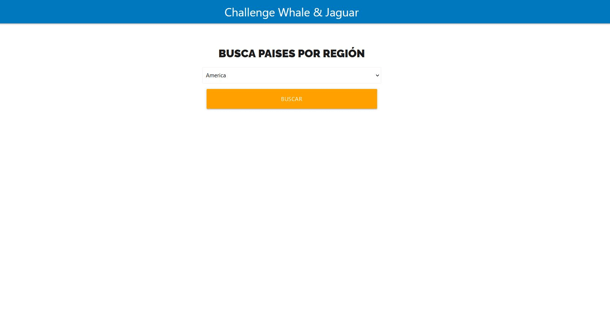
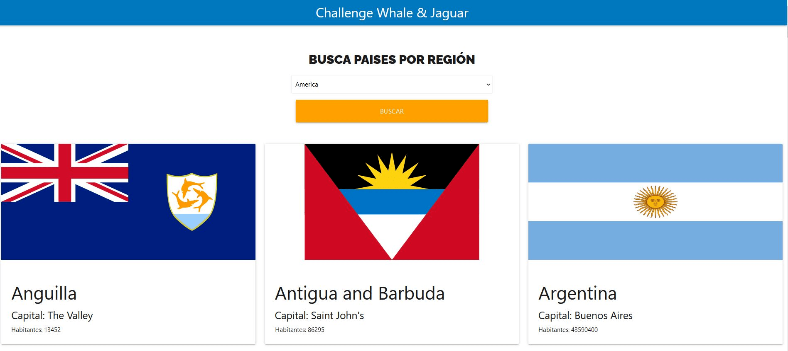
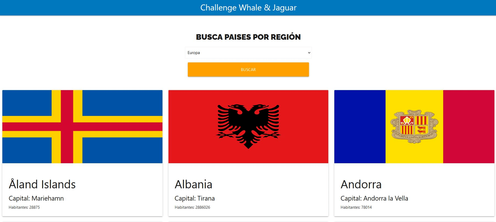

# Getting Started with Create React App

This project was bootstrapped with [Create React App](https://github.com/facebook/create-react-app).

## Como empezar

Instala todas las depedencias del proyecto con:

### `npm install`

En el directorio del proyecto, puedes escribir:

### `npm start`

Abre [http://localhost:3000](http://localhost:3000) para visualizar en tu navegador.

## ¿Cómo funciona?
En la pantalla de inicio podemos seleccionar entre 5 regiones: África, América, Asia, Europa, Oceania.
Podemos filtrar paises según la región que seleccionemos y visualizar su bandera, nombre del país, capital y población.
Toda la información es extraída de la API: https://restcountries.eu/

## Algunas capturas

##

##

